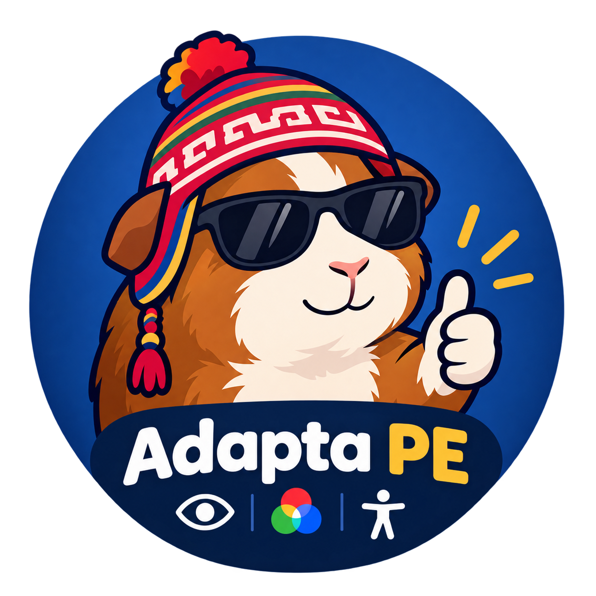
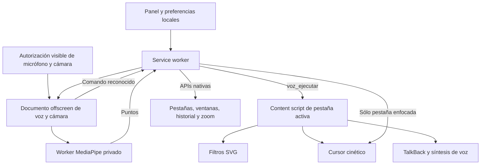

<p align="center">
  
</p>

# 🇵🇪 Adapta PE — Sistema de accesibilidad por voz y movimiento

> **Versión del código:** 12.0 · Manifest V3.
> **Requisito mínimo del manifest:** Chromium 116 o posterior.
> **Navegadores objetivo:** Google Chrome y derivados Chromium, como Edge y Brave; la voz requiere una API de reconocimiento disponible.
> **Sitio oficial:** [adaptape.thealejo-dev.cc](https://adaptape.thealejo-dev.cc).
> **Código fuente:** [TheAlejo160/Adapta-PE](https://github.com/TheAlejo160/Adapta-PE).

## Contenido

- [Qué es y qué versión elegir](#qué-es-y-qué-versión-elegir)
- [A quién está dirigida](#a-quién-está-dirigida)
- [Cómo se utiliza en el día a día](#cómo-se-utiliza-en-el-día-a-día)
- [Descarga e instalación](#descarga-e-instalación)
- [Primer uso](#primer-uso)
- [Usos y ejemplos](#usos-y-ejemplos)
- [Comandos de voz](#comandos-de-voz)
- [Cursor cinético y TalkBack](#cursor-cinético-y-talkback-sólo-base)
- [Filtros de color](#filtros-de-color)
- [Arquitectura y código](#arquitectura-y-código)
- [Backend Python opcional](#backend-python-opcional-estado-real)
- [Privacidad y alcance](#privacidad-y-alcance)
- [Actualizaciones y solución de problemas](#actualizaciones-y-solución-de-problemas)
- [Desarrollo y comprobaciones](#desarrollo-y-comprobaciones)
- [Trabajo futuro](#trabajo-futuro)
- [Autoría, licencia y uso de IA](#autoría-licencia-y-uso-de-ia)

## Qué es y qué versión elegir

**Adapta PE** es un sistema de accesibilidad Hands-Free distribuido como extensión de navegador. Facilita la navegación para personas con movilidad reducida o necesidades visuales mediante voz, un puntero controlado con cámara, lectura contextual y filtros de color. La versión **Base**, también llamada **Completa**, incluye todos esos módulos.

| Función | Adapta PE (Base / Completa) | Adapta PE Lite |
| --- | --- | --- |
| Voz global, navegación, búsquedas y dictado | Sí | Sí |
| Siete filtros de color | Sí | Sí |
| TalkBack: lectura del elemento bajo el puntero | Sí | No |
| Cursor cinético y clic por permanencia | Sí | No |
| Cámara y modelos locales MediaPipe | Sí | No |
| Instalación documentada | Chrome Web Store o repositorio | Repositorio de Lite |

Cada variante es una extensión independiente, con sus propias preferencias y permiso de micrófono. Si instalas ambas, **activa Voz sólo en una** para evitar dos reconocedores simultáneos. Lite omite la cámara, los modelos de visión y TalkBack; no necesita esos recursos para sus funciones de voz y filtros.

## A quién está dirigida

Adapta PE Base está dirigida al público general, con especial atención a quienes encuentran difícil usar un ratón o teclado de forma continuada:

- Personas con movilidad limitada, temblores, ausencia de extremidades o dificultades para realizar movimientos precisos. Pueden combinar voz con seguimiento de la parte del cuerpo que les resulte más cómoda.
- Personas con necesidades visuales que buscan modificar los colores o escuchar el texto del elemento señalado.
- Personas que quieren reducir interacciones manuales al estudiar, trabajar o navegar, y quienes acompañan la configuración de una herramienta de accesibilidad.

Puedes activar cada módulo por separado. El diseño busca permitir control desde una postura cómoda y ajustes por voz, sin exigir manos o dedos en todos los modos. Su utilidad depende de la movilidad disponible, la iluminación, el reconocimiento y la estructura de la web; las pruebas de desarrollo no acreditan compatibilidad universal con todas las personas o ayudas técnicas.

## Cómo se utiliza en el día a día

| Módulo | Qué aporta | Cómo se controla |
| --- | --- | --- |
| Asistente de voz | Aperturas, búsquedas, pestañas, ventanas, dictado, selección y clic por nombre. | «Computadora» seguida de una orden. |
| Mouse cinético | Puntero virtual con movimiento de cabeza, torso, brazos, manos o textura visible. | Cámara, postura cómoda y órdenes de calibración, pausa, velocidad y amplitud. |
| TalkBack | Lectura contextual del elemento señalado. | Activarlo en el panel y señalar con el ratón o el puntero cinético. |
| Filtros de color | Siete transformaciones de presentación visual. | Elegir un filtro en el panel. |

La voz sigue disponible al cambiar de página o ventana. La cámara se abre una sola vez para la extensión, y el cursor y TalkBack reciben prioridad únicamente en la pestaña de la ventana enfocada. Los filtros se conservan también en las webs de fondo. Las páginas ya abiertas se conectan automáticamente; no necesitas recargarlas para empezar a usar los módulos.

La preparación inicial incluye los permisos visibles del navegador. Si necesitas apoyo para esa configuración, otra persona puede ayudarte a concederlos; después utiliza las órdenes disponibles para navegar y ajustar el cursor. En `chrome://` y otras páginas protegidas, usa «abre…», «busca…» o comandos de pestañas y ventanas: el cursor, los filtros y las acciones DOM sólo pueden actuar donde Chrome permite scripts de la extensión.

## Descarga e instalación

### Chrome Web Store

Abre [Adapta PE en Chrome Web Store](https://chromewebstore.google.com/detail/haglphebolbegbchdkgejkoblocehogp?utm_source=item-share-cb), pulsa **Añadir a Chrome** y confirma la instalación y los permisos. Después fija el icono de la extensión y sigue [Primer uso](#primer-uso).

La versión de la tienda puede diferir del código del repositorio descrito aquí. Para revisar o probar los cambios del código fuente, usa la instalación descomprimida.

### Desde el repositorio: ZIP o Git

**Descarga ZIP:** abre [el repositorio de Adapta PE](https://github.com/TheAlejo160/Adapta-PE), selecciona **Code → Download ZIP** y extrae el archivo en una carpeta permanente.

**Con Git:**

```bash
git clone https://github.com/TheAlejo160/Adapta-PE.git
```

No necesitas compilar, ejecutar `npm install` ni iniciar Python. Selecciona siempre **la carpeta que contiene directamente `manifest.json`**, no el ZIP ni una carpeta superior: normalmente `Adapta-PE` al clonar o `Adapta-PE-main` al extraer. En un entorno con ambas variantes puede llamarse `extensión`.

1. Abre `chrome://extensions/` en Chrome.
2. Activa **Modo de desarrollador**.
3. Pulsa **Cargar descomprimida** y selecciona esa carpeta.
4. Comprueba que aparezca **Adapta PE** habilitada y fija su icono en la barra de herramientas.
5. Las webs ya abiertas reciben los scripts automáticamente, sin recargarlas.

En Edge o Brave utiliza su página de extensiones equivalente. El soporte de reconocimiento de voz puede variar entre navegadores. No elimines ni muevas la carpeta mientras la instalación descomprimida la utilice.

## Primer uso

1. Fija el icono de la extensión desde el menú de extensiones de Chrome y abre su panel.
2. Activa **Voz**. Si falta autorización, se abrirá una página de la extensión: pulsa **Permitir micrófono** y acepta el permiso del navegador. También puedes abrirla con **Configurar micrófono** en el panel.
3. Di **«Computadora, abre YouTube»**. También puedes decir sólo **«Computadora»**, esperar el pitido y dar el comando dentro de los siguientes **8 segundos**.
4. Repite «Computadora» para cada nueva orden. Prueba «Computadora, busca accesibilidad en Wikipedia» o «Computadora, siguiente pestaña».
5. Para dictar, abre una web con un formulario, di «Computadora, enfoca correo» y después «Computadora, escribe Hola Perú». El campo debe ser visible y editable; su etiqueta o nombre debe coincidir con el que pronuncias.
6. Elige un filtro en el panel si lo necesitas. **Visión Normal (Sin Filtros)** restablece la presentación sin el filtro de Adapta PE.

La escucha continúa al navegar, cambiar de pestaña o ventana y usar Nueva pestaña. En las webs, un indicador muestra el estado; en páginas protegidas puedes consultarlo desde el panel. **Desactivar Voz libera el micrófono.** En Base, el documento central permanece mientras la cámara esté activa. El permiso pertenece a la extensión, no a cada sitio; una instalación diferente puede requerir su propia autorización.

La configuración inicial requiere abrir el panel y aceptar los permisos del navegador. Los comandos permiten después controlar las acciones admitidas del navegador y de la página.

## Usos y ejemplos

| Necesidad | Cómo utilizar la extensión |
| --- | --- |
| Investigar o estudiar | «Computadora, abre Wikipedia» y «Computadora, busca accesibilidad en Wikipedia». |
| Navegar entre tareas | «Computadora, abre Gmail en una nueva pestaña» y «Computadora, siguiente pestaña». |
| Completar un formulario | «Computadora, enfoca correo», «Computadora, escribe mi dirección» y, al terminar, «Computadora, enviar formulario». |
| Elegir un elemento de una tienda | «Computadora, selecciona zapatos azules», revisar el resaltado y después «Computadora, dale clic». |
| Ajustar la presentación de una web | Elegir un filtro de color en el panel o retirarlo con **Visión Normal**. |

Las frases son ejemplos: cambia el nombre del campo, producto o enlace por el que realmente aparezca en la web. Una orden como «enviar formulario» o «clic en Confirmar» ejecuta la acción del sitio; revisa su contenido antes de dar la orden.

### Seleccionar antes de hacer clic

1. Di «Computadora, selecciona» seguido del nombre visible o accesible del elemento. También acepta «seleccionar» y «resalta».
2. La extensión lo acerca a la vista, coloca un contorno amarillo y anuncia la selección. **Seleccionar no hace clic.**
3. Di «Computadora, dale clic», «Computadora, hazle clic» o «Computadora, activa lo seleccionado» para activarlo una vez.
4. Para retirarlo, di «Computadora, cancelar selección» o «Computadora, quita la selección».

La selección pertenece a esa página. Cambiar de pestaña no traslada el objetivo a otra web. Si el elemento desaparece, se deshabilita o queda oculto, la confirmación no activa un control diferente: vuelve a seleccionarlo. La búsqueda por nombre depende del texto, etiquetas y estructura accesible de cada sitio; no identifica productos a partir de una descripción libre de su imagen.

## Comandos de voz

Los ejemplos de esta sección se pronuncian después de **«Computadora»** o dentro de su ventana de escucha. El reconocimiento está configurado en español de Perú (`es-PE`).

| Orden y variantes | Resultado |
| --- | --- |
| `abre YouTube`, `ejecuta Netflix`, `visita GitHub` | Abre la portada de un sitio del catálogo. |
| `abre example.com`, `abre https://example.com` | Abre un dominio o URL HTTP/HTTPS explícita. |
| `busca Perú en YouTube`, `busca en Wikipedia accesibilidad` | Busca en la plataforma indicada; admite `consulta`, `encuentra`, `investiga` y `haz una búsqueda de…`. |
| `busca accesibilidad` | Usa la plataforma actual si tiene búsqueda en el catálogo; si no, intenta un formulario de búsqueda visible y finalmente Google. |
| `abre YouTube en una nueva pestaña`, `busca Perú en otra ventana` | El modificador al final elige el destino. Sin modificador, la apertura o búsqueda usa la pestaña actual. |
| `nueva pestaña`, `abre una nueva ventana` | Crea la página Nueva pestaña nativa del navegador. |
| `cierra esta pestaña`, `cerrar ventana` | Cierra la pestaña o toda la ventana de destino. |
| `atrás`, `volver`, `regresa`; `adelante`, `avanza` | Navega por el historial de la pestaña. |
| `recarga`, `actualiza la página`, `refrescar página` | Recarga la pestaña. |
| `siguiente pestaña`, `pestaña anterior` | Recorre las pestañas de la misma ventana, volviendo al extremo opuesto al llegar al final. |
| `baja`, `abajo`, `sube`, `arriba` | Desplaza el 70 % de la altura de pantalla. `Sube un poco` usa 25 %; `baja más`, 95 %. |
| `ve al inicio`, `ir al final` | Va al principio o al final de la página. |
| `aumenta zoom`, `acerca`; `reduce zoom`, `aleja`; `zoom normal` | Cambia el zoom en pasos de 10 puntos porcentuales, entre 25 % y 500 %, o lo devuelve al 100 %. |
| `enfoca correo`, `enfoca nombre` | Enfoca un campo visible por etiqueta, nombre accesible o placeholder. |
| `escribe Hola Perú`, `dicta…`, `introduce…` | Inserta texto en el cursor o selección del campo enfocado. Admite campos editables y `contenteditable`. |
| `borra el texto`, `limpia el campo` | Vacía el campo editable enfocado. |
| `presiona enter`, `pulsa enter`, `enviar formulario` | Solicita el envío del formulario del campo enfocado, respetando su validación. |
| `clic en Contacto`, `haz clic en Guardar`, `pulsa…` | Activa un enlace o control visible por su nombre accesible. `Abrir [nombre]` también puede activar botones o enlaces. |
| `selecciona zapatos azules`, `seleccionar…`, `resalta…` | Resalta un elemento visible por su nombre, lo acerca a la vista y anuncia la selección; todavía no hace clic. |
| `dale clic`, `hazle clic`, `activa lo seleccionado` | Activa la selección una sola vez. Si desapareció o quedó oculta, debes seleccionarla de nuevo. |
| `clic`, `haz clic` | Activa la selección si existe; después usa el cursor cinético de Base o el elemento enfocado. |
| `reproduce el video`, `continuar video`, `pausa el audio` | Reproduce o pausa el primer video/audio encontrado. La web puede exigir una interacción para reproducir. |
| `cancela`, `cancelar`, `olvídalo` | Cancela el comando pendiente y retira la selección. |

El dictado conserva el texto reconocido, incluidos acentos, mayúsculas y signos. Las palabras de navegación dentro del dictado o una búsqueda no se tratan como órdenes independientes. La puntuación y precisión finales dependen del reconocimiento del navegador.

### Sitios y búsquedas

El catálogo compartido de `sitios.js` incluye Google, YouTube, Mercado Libre, Amazon, Wikipedia, Facebook, Instagram, X/Twitter, Reddit, Netflix, Twitch, GitHub, ChatGPT, Claude, Gemini, Canvas, Gmail, Outlook/Hotmail, WhatsApp, Telegram, Google Drive, Google Docs, Google Maps, LinkedIn, TikTok, Spotify, Bing y DuckDuckGo. Acepta alias como «You Tube», «Git Hub», «Chat GPT», «equis», «wasap» y «mapas».

Las aperturas usan portadas explícitas. Las búsquedas usan las rutas del catálogo; cuando una plataforma no tiene ruta configurada, se abre una búsqueda de Google con `site:dominio`. Esto **no consulta correo, documentos ni contenido privado** de esas plataformas. Canvas usa una portada genérica; para una institución concreta, abre su dominio. Un nombre desconocido en «abre…» se busca entre los controles de la página y no se convierte automáticamente en una búsqueda de Google.

Cuando una apertura o búsqueda pide otra ventana, el worker intenta situarla en un monitor secundario disponible. «Nueva ventana» sin URL crea la ventana nativa, sin esa selección de pantalla.

### Límites de navegación

Chrome impide ejecutar content scripts en páginas protegidas, como `chrome://` y Chrome Web Store. Allí la voz central permite las operaciones nativas admitidas, como aperturas, búsquedas, pestañas, ventanas, historial y zoom, según las restricciones del navegador. **No escribe en la barra de direcciones ni pulsa botones de la interfaz de Chrome.** Dictado, clic, desplazamiento y filtros necesitan una página web donde pueda ejecutarse el content script.

La compatibilidad con formularios, reproductores, editores complejos, iframes y controles depende de cómo esté construida cada web. Los eventos sintéticos no siempre equivalen a una interacción física aceptada por el sitio.

## Cursor cinético y TalkBack (sólo Base)

### Empezar con la cámara

1. Abre una web donde Chrome permita content scripts. Activa **Mouse Cinético** desde el panel o di «Computadora, activar cursor» con Voz ya habilitada.
2. Adapta PE abre su página visible de autorización: permite la cámara **una vez al origen de la extensión**, independiente del micrófono. El botón recibe el foco para poder usar Enter. Después vuelve automáticamente a tu página; cambiar de sitio no solicita otro permiso de cámara.
3. Colócate en una postura cómoda, con iluminación y la parte del cuerpo elegida visible. Descansa aproximadamente un segundo, o hasta escuchar **«Cursor listo. Postura cómoda calibrada»**. No tienes que mantener la cabeza en el centro de la imagen.
4. Muévete ligeramente desde esa postura para dirigir el puntero virtual. Recupera tu postura cómoda para detenerlo en la zona segura.
5. Para un clic automático, mueve primero fuera de la zona de atracción durante al menos **180 ms**, vuelve a la zona segura y permanece sobre el mismo objetivo durante **1.000 ms**. Tras hacer clic debes repetir la salida y el regreso para habilitar otro.

La burbuja de cámara y su indicador son informativos, sin botones ni selección manual de puntos. La postura se calibra sin clic en cada página que recibe el control. Una sola cámara permanece en el documento central al navegar o cambiar de ventana; sólo la pestaña enfocada muestra y controla el cursor y TalkBack. Al pasar a páginas protegidas o salir del navegador se suspende la inferencia y el control, conservando el flujo hasta desactivar Mouse Cinético. La cámara no depende del permiso ni de la política de cámara de cada sitio.

### Órdenes del cursor

Añade «Computadora» antes de cada orden:

| Orden | Acción |
| --- | --- |
| `activar cursor`, `desactivar cursor` | Activa o apaga la cámara y guarda el estado del módulo. |
| `postura cómoda`, `calibrar cursor`, `recalibrar`, `centrar cursor` | Aprende de nuevo tu postura de reposo sin mover el cursor ni habilitar clic durante la calibración. |
| `pausar cursor`, `descansar` | Pausa movimiento y clic; mantiene la cámara del módulo activo. |
| `reanudar cursor`, `continuar cursor` | Reanuda con una nueva calibración. |
| `control automático` | Selecciona una mano visible al iniciar, o cabeza/torso, y mantiene la fuente mientras siga visible. |
| `control cabeza`, `control rostro`, `control torso` | Selecciona la fuente indicada. |
| `control brazo izquierdo`, `control brazo derecho` | Sigue una articulación visible del brazo elegido y la conserva mientras sea visible. |
| `control manos` | Usa detección de manos. |
| `control zona libre`, `control muñón` | Sigue textura visible, sin identificar anatomía. |
| `activar temblor`, `ajustar temblor`, `desactivar temblor` | Amplía o restablece la zona segura; repetir la activación no la desactiva. |
| `movimientos pequeños`, `movilidad reducida`, `movimientos normales` | Ajusta la amplitud necesaria y recalibra para la nueva escala. |
| `cursor más lento`, `cursor más rápido` | Ajusta la sensibilidad de velocidad dentro de sus límites. |
| `clic`, `clic derecho`, `anticlic`, `menú contextual` | Solicita clic izquierdo o derecho cuando el seguimiento está listo. |
| `siguiente clic derecho`, `activar clic derecho` | Prepara un clic derecho para el siguiente clic por permanencia. |
| `cancelar clic` | Cancela la fijación y el menú propio, y restablece el siguiente clic a izquierdo. |

Las órdenes de ajuste necesitan la cámara activa. El clic derecho emite `contextmenu`: si la web no lo maneja, aparece un menú propio de Adapta PE. **Los eventos sintéticos no abren el menú nativo de Chrome.**

### Cómo funciona el seguimiento

`voz/camara.js` captura en el documento offscreen de Base y utiliza `vision/trabajador.js` con MediaPipe local en CPU: rostro, Pose Lite y manos. La inferencia recibe hasta **320 × 240** conservando la proporción, con hasta **20 imágenes nuevas/s**; la vista y Zona libre usan **160 × 120**. La vista previa se actualiza por separado, hasta **30 imágenes/s** según la cámara y el equipo, sin esperar inferencias y sin acumular envíos. El worker del navegador entrega los puntos sólo al controlador prioritario. `KineticEngine` se ocupa de calibración, física, interacción y vista; nunca abre cámaras en las webs. Sólo hay un `ImageBitmap` en vuelo; se libera tras la inferencia. El paquete, WASM y modelos se distribuyen con la extensión, sin CDN ni backend Python.

La calibración necesita al menos cuatro inferencias distintas durante 900 ms, en una ventana de 1.200 ms. Usa mediana, percentil 80 y deriva para no aprender un movimiento en curso. Una mediana de tres inferencias y suavizado por tiempo real filtran el movimiento. La zona segura circular conserva el centro fijo; la desviación de la postura se escala igual en ambos ejes. La velocidad se calcula en píxeles por segundo, sin depender del número de frames.

Cambiar de fuente requiere tres detecciones y 1.200 ms antes de recalibrar. Detecciones con más de 500 ms de antigüedad no mueven el cursor; pérdida, pausa, calibración y saltos de tiempo desarman el clic. Una pérdida prolongada o descanso contra un borde puede iniciar recuperación de postura; mantener una dirección dentro de la página no debe recentrarla.

El modo Zona libre sigue textura y puede perderla con oclusiones o bajo contraste. **No hay validación universal para amputaciones, ayudas técnicas o todas las cámaras.** Consulta [la documentación de visión local](vision/README.md) para procedencia de modelos y licencias de terceros.

### Usar TalkBack

Activa **TalkBack** en el panel y pasa el puntero sobre un elemento. Tras **300 ms**, lee su nombre accesible, texto alternativo o contenido legible y lo destaca con un contorno. Funciona con el ratón y con el cursor cinético, que emite eventos de entrada/salida al cambiar de objetivo. Usa la síntesis de voz `chrome.tts` del navegador; depende de las voces disponibles.

Es una lectura contextual por puntero, sin navegación completa por teclado ni todas las funciones de un lector de pantalla del sistema. En imágenes usa el texto alternativo disponible; no genera una descripción con IA.

## Filtros de color

El panel ofrece siete filtros y una opción sin filtro:

| Opción | Transformación disponible |
| --- | --- |
| Protanomalía y Protanopia | Matrices para variaciones en los canales asociados al rojo/verde. |
| Deuteranomalía y Deuteranopia | Matrices para variaciones en los canales asociados al verde/rojo. |
| Tritanomalía y Tritanopia | Matrices para variaciones en los canales asociados al azul/amarillo. |
| Acromatopsia | Escala de grises. |
| Visión Normal | Retira el filtro de Adapta PE. |

`FiltrosDaltonismo` inserta un SVG con `feColorMatrix` y aplica una referencia CSS al documento y a los selectores de pantalla completa. Por ejemplo, la matriz de Protanopia calcula `R′ = 0.567R + 0.433G`, `G′ = 0.558R + 0.442G` y `B′ = 0.242G + 0.758B`.

Son transformaciones visuales fijas: no diagnostican ni corrigen médicamente el daltonismo, y su utilidad puede variar entre personas y sitios. Elige la opción que te resulte más cómoda; los nombres no implican una corrección personalizada.

## Arquitectura y código

La extensión utiliza **HTML, CSS y JavaScript nativo**, sin React, Vue ni jQuery. Manifest V3 separa las preferencias, las operaciones privilegiadas y las acciones sobre páginas.



### Responsabilidad de los archivos

| Archivo | Función |
| --- | --- |
| `manifest.json` | Versión, permisos, service worker y orden de inyección. Exige Chromium 116 o posterior. |
| `popup.html` / `popup.js` | Panel, lectura y escritura de preferencias en `chrome.storage.local`; avisos `actualizar_estado` a las pestañas. |
| `voz/popup.js` | Estado global de escucha en el panel y botón para configurar micrófono. |
| `sitios.js` | Catálogo único de portadas, rutas de búsqueda y alias; `normalizarVoz()` y `reconocerSitio()`. También se carga en el worker con `importScripts`. |
| `background.js` | `sincronizarPaginas()` reconecta y asigna prioridad; `sincronizarVoz()` serializa creación/cierre offscreen; `gestionarVoz()` fija la pestaña activa por frase; `ejecutarAccion()` y `gestionarAperturaURL()` usan las APIs del navegador. |
| `voz/escucha.html` / `voz/escucha.js` | Único reconocedor activo por extensión. Comunica comandos y estado mediante runtime; consulta las preferencias y pestañas a través del worker. |
| `voz/permisos.html` / `voz/permisos.js` | Autorización visible: solicita micrófono o cámara, detiene el flujo de prueba y reinicia la entrada central. Tras autorizar cámara, vuelve a la página anterior. |
| `classes/VoiceAssistant.js` | Clase reutilizable: reconocimiento en offscreen y parser de comandos DOM en la página. |
| `classes/FiltrosDaltonismo.js` | Inserta, aplica y retira filtros SVG/CSS. |
| `content_script.js` | Instancia los módulos de esta variante, aplica preferencias y recibe órdenes e indicadores. Añade `data-adapta-extension="true"` para detección por la web oficial. |
| `classes/TalkBack.js` | Lectura semántica por hover, contorno y debounce de 300 ms. |
| `classes/KineticEngine.js` | Recibe detecciones recientes; calibración, movimiento, clic por permanencia y menú contextual. |
| `voz/camara.js` | Captura única central, permiso y token de generación; envía inferencias y una vista de cámara efímera al controlador prioritario. Sólo Base. |
| `vision/trabajador.js` | Worker privado con MediaPipe, modelos y WASM empaquetados. Sin recursos de visión públicos. |
| `app.py` | Prototipo Flask opcional y separado; no interviene en las funciones actuales de la extensión. |

### Recorrido de una orden de voz

1. El panel guarda `voz`; el worker sincroniza un documento offscreen mediante una promesa serializada para evitar escuchas duplicadas o reactivaciones tras apagar.
2. `voz/escucha.js` inicia `VoiceAssistant` cuando el micrófono tiene permiso. Los content scripts usan su parser, **sin iniciar reconocimiento ni micrófono**.
3. El reconocedor agrupa resultados finales durante **550 ms** y provisionales estables durante **1.200 ms**. Consume prefijos por índice para no repetir la orden cuando llega el resultado final; una transcripción idéntica no reinicia la espera.
4. Tras «Computadora», el texto se envía al worker. Éste comprueba el origen central y toma una sola vez la pestaña activa de la última ventana enfocada.
5. En una web, envía `voz_ejecutar` a su content script. Si falta el controlador, lo conecta sin recargar la web; si Chrome protege la página, usa el parser central para las operaciones permitidas del navegador.
6. La clase reinicia el reconocimiento al terminar, con esperas entre **300 ms y 5 s** según los fallos. Un permiso denegado requiere corregirlo y reactivar Voz.

El worker conecta automáticamente los controladores al instalar, actualizar, cambiar de pestaña o ventana y modificar preferencias. `chrome.scripting` permite recuperar webs ya abiertas sin recargarlas; la inyección es idempotente y usa el documento concreto para evitar ejecutar en una navegación posterior. La selección por voz pertenece a cada página. Los filtros se aplican también en pestañas de fondo; voz, cursor y TalkBack priorizan la pestaña de la ventana enfocada.

El worker responde de forma asíncrona y captura fallos. Las aperturas de URL admiten sólo HTTP/HTTPS. Los avisos a pestañas sin receptor manejan silenciosamente la desconexión para no saturar la consola.

### Mensajes, selección y reconexión

`VoiceAssistant` interpreta patrones y sinónimos definidos en JavaScript: no consulta un modelo generativo para decidir qué acción ejecutar. `normalizarVoz()` normaliza las intenciones y los nombres; el dictado utiliza la transcripción original para conservar acentos y mayúsculas. `sitios.js` separa la portada de cada plataforma de su ruta de búsqueda.

| Mensaje | Recorrido y responsabilidad |
| --- | --- |
| `voz_comando` | El documento central entrega la frase al service worker, que captura una sola pestaña de destino. |
| `voz_ejecutar` | El worker entrega la frase al parser DOM de ese documento. |
| `voz_fallback` | En páginas protegidas, el parser central resuelve únicamente las operaciones nativas admitidas. |
| `pagina_lista` / `control_prioridad` | El controlador se registra y el worker determina qué página recibe la prioridad. |
| `voz_resultado` / `voz_indicador` | Comunican el resultado y actualizan el indicador de la página prioritaria. |
| `hablar` / `callar` | El worker utiliza `chrome.tts` para emitir o detener las confirmaciones habladas. |
| `actualizar_estado` / `chrome.storage.onChanged` | Propagan las preferencias a controladores existentes. |

La selección vive en `VoiceAssistant.elementoSeleccionado`, sin guardarse en almacenamiento. `encontrarElemento()` busca coincidencias completas antes de parciales; `seleccionarElemento()` añade un atributo y CSS propios; `pulsarSeleccion()` comprueba la disponibilidad del objetivo, lo activa y limpia la selección. Los nombres pueden proceder de `aria-label`, etiquetas, texto visible, `alt`, placeholder o título.

`asegurarControlador()` comprueba `adaptaPEControlador.vigente()` y utiliza `chrome.scripting.executeScript()` si falta el controlador. Las clases y el catálogo se exportan desde IIFE para admitir reinyección. El destino se fija mediante `documentId`, y un evento DOM propio permite retirar recursos del contexto anterior al actualizar. `sincronizarPaginas()` serializa los cambios y descarta transiciones antiguas; los avisos a páginas sin receptor capturan las desconexiones.

### Preferencias y permisos

Base guarda `talkback`, `voz`, `daltonismo` y `ojos`. `ajustesCineticos` conserva sólo modo de control, temblor, velocidad y amplitud; no guarda postura ni imágenes. El controlador aplica esos ajustes antes de iniciar la cámara.

El manifest incluye CSP con `wasm-unsafe-eval` para el runtime local de visión. No expone recursos de visión a las webs; captura, worker, modelos y WASM permanecen privados en el origen de extensión. La vista de cámara usa un shadow DOM cerrado.

| Permiso del manifest | Uso |
| --- | --- |
| `storage` | Preferencias locales de la extensión. |
| `tabs` | Consultar la pestaña de destino y gestionar navegación/pestañas. |
| `scripting` | Conectar o recuperar los módulos en webs ya abiertas sin recargar la página. |
| `system.display` | Consultar pantallas al abrir una URL en otra ventana. |
| `offscreen` | Mantener una sola cámara y escucha independientes de las páginas. |
| `tts` | Síntesis de voz para TalkBack, avisos del cursor y selección por voz. |
| `<all_urls>` | Inyectar funciones de accesibilidad en los sitios permitidos por Chrome; no evita sus restricciones de páginas protegidas. |

El permiso de micrófono y el permiso de cámara se concede mediante las APIs de medios y sus avisos correspondientes; no lo reemplaza el acceso a sitios del manifest.

## Backend Python opcional: estado real

`app.py` existe como **prototipo de desarrollo** del «Ojo Biónico». No hay conexión actual desde el panel, TalkBack o el content script, ni un modelo que analice imágenes. **No necesitas Python para usar la extensión**, la voz o los filtros, TalkBack o el cursor cinético.

Si deseas probar el prototipo, desde la carpeta que contiene `app.py`, con Python 3.8 o posterior:

```bash
python -m venv .venv
# macOS / Linux
source .venv/bin/activate
# Windows: .venv\Scripts\activate
python -m pip install flask flask-cors
python app.py
```

| Ruta | Entrada y salida actuales |
| --- | --- |
| `GET /estado` | JSON con el mensaje de disponibilidad del servidor. |
| `POST /analizar_imagen` | Recibe JSON con `src`, registra ese valor, espera un segundo y devuelve siempre la misma descripción simulada. |

Comprueba el estado en `http://127.0.0.1:5000/estado`. El script arranca en modo de depuración y con CORS general; es un prototipo local, sin restricciones de origen específicas ni configuración de producción.

## Privacidad y alcance

- La extensión guarda preferencias en `chrome.storage.local`. No implementa almacenamiento de grabaciones o transcripciones; el texto del indicador de voz vive en memoria.
- El reconocimiento depende de `SpeechRecognition` / `webkitSpeechRecognition` del navegador y **puede enviar audio a un servicio en línea**. No se garantiza voz sin conexión ni procesamiento de audio exclusivamente local.
- Los comandos leen los elementos necesarios de la página para encontrar campos, enlaces y botones. Las búsquedas envían la consulta al sitio o buscador elegido como una navegación normal.
- El código de la extensión no implementa recopilación de cookies, contraseñas ni un registro de historial. El comando «atrás/adelante» utiliza el historial de la pestaña mediante las APIs del navegador.
- La cámara cinética se procesa localmente en memoria. La extensión no guarda ni envía a servidores sus fotogramas; MediaPipe y sus modelos se cargan del paquete local. Esto es independiente del posible procesamiento en línea de la voz.
- Sólo se conserva la postura mientras funciona el motor. Cambiar de pestaña o ventana conserva la cámara central; el nuevo controlador calibra sin clic y no exige volver a conceder el permiso.

El funcionamiento depende del reconocimiento disponible, los permisos y la estructura de cada web. Adapta PE facilita acciones de accesibilidad; no garantiza acceso completo a cualquier sitio ni reemplaza todas las funciones de un lector de pantalla del sistema.

## Actualizaciones y solución de problemas

Para una instalación desde el repositorio, descarga los cambios o ejecuta `git pull` dentro de la carpeta clonada. Después **recarga la extensión una vez en `chrome://extensions/`**. El worker reconecta automáticamente las webs abiertas; no tienes que recargar cada página. La instalación de la tienda puede llevar una versión distinta de la del repositorio; este README describe el código de esta carpeta.

| Problema | Comprobación |
| --- | --- |
| No escucha o indica micrófono no disponible | Abre **Configurar micrófono**, revisa el permiso de la extensión y del sistema operativo, y desactiva/activa Voz después de corregirlo. |
| El navegador no admite reconocimiento | Comprueba la disponibilidad de su API de voz. Ser Chromium no garantiza reconocimiento; prueba en Google Chrome con los permisos concedidos. |
| Repite órdenes o compite por el micrófono | Comprueba que Voz esté activa en una sola variante de Adapta PE. |
| «Reconectando micrófono» persiste | Revisa conexión, disponibilidad del servicio de reconocimiento y dispositivo de audio; el motor reintenta automáticamente los fallos recuperables. |
| Dictado, clic o filtros no funcionan en Nueva pestaña | Son acciones de página; prueba en una web permitida. Usa «abre…» o «busca…» para salir de Nueva pestaña. |
| El dictado no se inserta | Enfoca un campo visible y editable; comprueba su nombre con «enfoca…». |
| No responde tras actualizar | Recarga la extensión; reconecta las webs permitidas automáticamente. Comprueba el acceso al sitio concedido en Chrome. |
| La cámara no arranca | Comprueba permiso de cámara de la extensión y del sistema y la disponibilidad del dispositivo; apaga y vuelve a activar el cursor tras corregirlo. |
| El cursor no calibra o pierde seguimiento | Mantén una postura estable e iluminación suficiente; prueba el modo de control apropiado o «postura cómoda». En Zona libre evita texturas uniformes y oclusiones. |
| No hace clic por permanencia | Espera la calibración, sal de la atracción y vuelve a la zona segura sobre el mismo objetivo durante un segundo. |
| Service worker aparece «Inactiva» | Es normal en Manifest V3: despierta cuando recibe eventos. |

Los avisos de publicidad de YouTube, `ERR_BLOCKED_BY_CLIENT`, `ublock-filters.js` o `ryd.content-script.js` pueden proceder del sitio o de otras extensiones. Para reportar un fallo de Adapta PE, indica variante, versión del manifest, navegador, comando, estado del indicador, nombre del archivo y excepción; evita incluir datos privados.

## Desarrollo y comprobaciones

Mantén JavaScript nativo, nombres y mensajes en español, IDs propios con prefijo `adapta-pe-` y manejo de desconexiones en mensajes a pestañas. Revisa las funciones por nombre; los números de línea cambian al editar.

Los módulos de voz, filtros, `sitios.js`, `voz/escucha.js`, `voz/permisos.js`, `voz/popup.js` y funciones compartidas de `background.js` deben mantenerse sincronizados entre variantes. Base utiliza `classes/` y Lite `clases/`; los cambios comunes de manifest/controlador respetan los permisos y módulos de cada una. **No copies TalkBack, KineticEngine ni visión a Lite.**

Las pruebas compartidas del entorno de desarrollo buscan Lite como carpeta hermana llamada `extensiónLite`. **La carpeta `tests/` está excluida del control de versiones mediante `.gitignore`: los comandos de prueba sólo funcionan si dispones de esos archivos locales.** Clonar las dos extensiones por sí solo no descarga las pruebas. Para preparar la estructura de carpetas:

```bash
git clone https://github.com/TheAlejo160/Adapta-PE.git extensión
git clone https://github.com/TheAlejo160/Adapta-PE-Lite.git extensiónLite
cd extensión
```

Si cuentas con los archivos de pruebas locales, ejecuta `node tests/motores.test.cjs` desde Base. El archivo utiliza Node y módulos nativos, sin instalar dependencias; comprueba ambas variantes con DOM/cámara simulados. Cubre comandos, preferencias, reconocimiento, sincronización entre variantes y mecánicas del cursor. La integración de Chrome verifica páginas abiertas antes de instalar, selección/clic en ambas variantes, traspaso de cámara entre ventanas y continuidad sin permisos por sitio. Lite no contiene una carpeta de pruebas propia.

Si dispones de `tests/browser.test.cjs`, comprueba la integración real MV3, DOM y cámara central:

```bash
node tests/browser.test.cjs
```

Esta prueba requiere un Node con `fetch` y `WebSocket` globales, y Chrome con el método CDP `Extensions.loadUnpacked`. Usa un perfil temporal, cámara/audio sintéticos y comandos inyectados. Silencia la salida de audio y registra los avisos TTS en memoria durante las pruebas; **no prueba la precisión real del reconocimiento ni accesibilidad universal con personas usuarias**. Por defecto busca Chrome en `/Applications/Google Chrome.app/Contents/MacOS/Google Chrome`; puedes indicar otro ejecutable con `ADAPTA_CHROME`.

Antes de distribuir cambios, prueba además la autorización visible, navegación entre webs/ventanas, dictado en un formulario, desactivación de Voz y los filtros. En Base verifica también calibración, pérdida de seguimiento, pausa, clic por permanencia y liberación de cámara.

## Trabajo futuro

Estas ideas del proyecto no forman parte de las funciones actuales ni tienen una fecha comprometida:

- Integrar un modelo real y conectar el «Ojo Biónico» con la interfaz.
- Incorporar reconocimiento de voz sin conexión.
- Evaluar una guía adicional de calibración de varios puntos; hoy existe calibración automática por postura, sin selección física de puntos.
- Ampliar idiomas a quechua, aymara, inglés y portugués.

## Autoría, licencia y uso de IA

<a href="https://adaptape.thealejo-dev.cc">Adapta PE</a> © 2026 by <a href="https://thealejo-dev.cc">Rodrigo Alejandro Apcho Aliaga</a> is licensed under <a href="https://creativecommons.org/licenses/by-nc-sa/4.0/">Creative Commons Attribution-NonCommercial-ShareAlike 4.0 International</a>

Desarrollado con dedicación para promover la inclusión digital y la accesibilidad universal en el Perú y el mundo.

### Derechos de autor y condiciones de reutilización

**© 2026 Rodrigo Alejandro Apcho Aliaga — TheAlejo160.** Autor y responsable del diseño, integración y supervisión de este proyecto.

Se conserva la licencia del proyecto **Creative Commons Atribución-NoComercial-CompartirIgual 4.0 Internacional (CC BY-NC-SA 4.0)**. Permite compartir y adaptar el material sujeto a sus condiciones:

- Reconocer la autoría, enlazar la licencia e identificar las modificaciones.
- Mantener la reutilización bajo fines no comerciales.
- Distribuir las adaptaciones con la misma licencia o una compatible admitida por ella.
- Evitar condiciones o medidas tecnológicas que limiten los usos que la licencia permite.

Consulta el [resumen oficial en español](https://creativecommons.org/licenses/by-nc-sa/4.0/deed.es) y el [texto legal](https://creativecommons.org/licenses/by-nc-sa/4.0/legalcode.es). Los avisos del repositorio se mantienen en [LICENSE](LICENSE) y [LICENSE.txt](LICENSE.txt).

### Declaración de uso de IA

> 🤖 **Declaración de uso de Inteligencia Artificial:** En este proyecto se utilizaron herramientas de Inteligencia Artificial generativa para la creación y optimización de recursos gráficos/imágenes, así como para la asistencia y co-creación en partes específicas del código fuente (sin abarcar la totalidad del desarrollo, el cual fue diseñado, integrado y supervisado por el autor).

### Componentes de terceros

Los componentes de visión mantienen sus propias licencias y atribuciones, distintas de la licencia del proyecto. Consulta [vision/README.md](vision/README.md) y [vision/vendor/LICENSE](vision/vendor/LICENSE).
